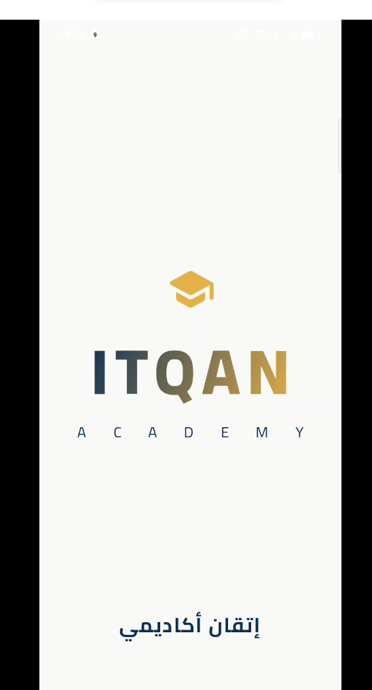
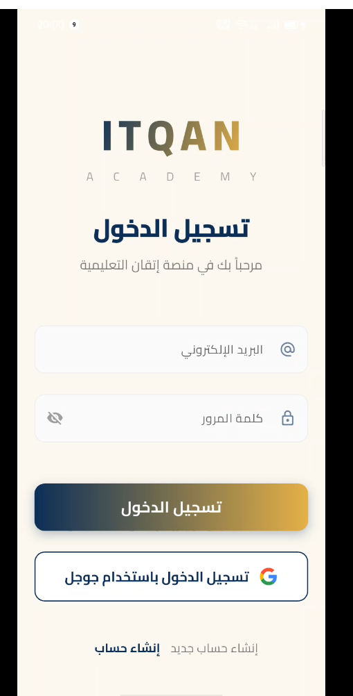
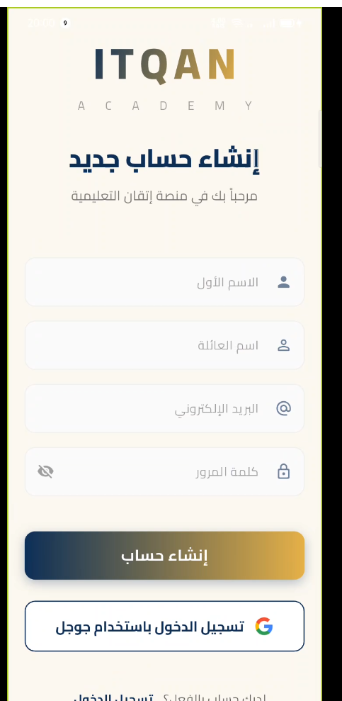
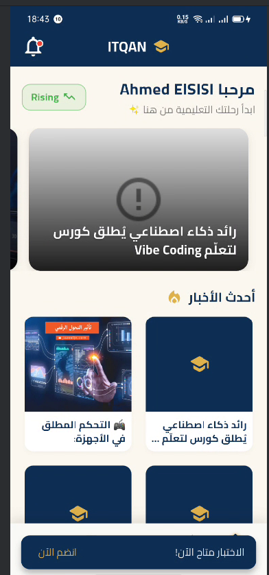
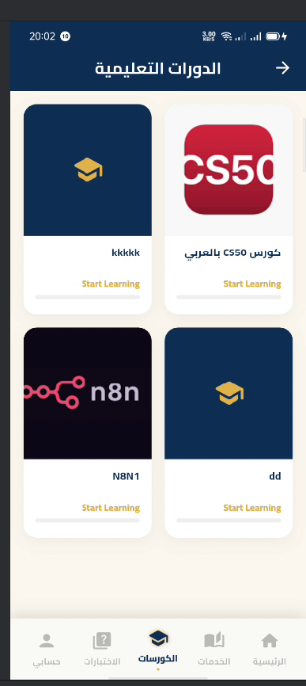
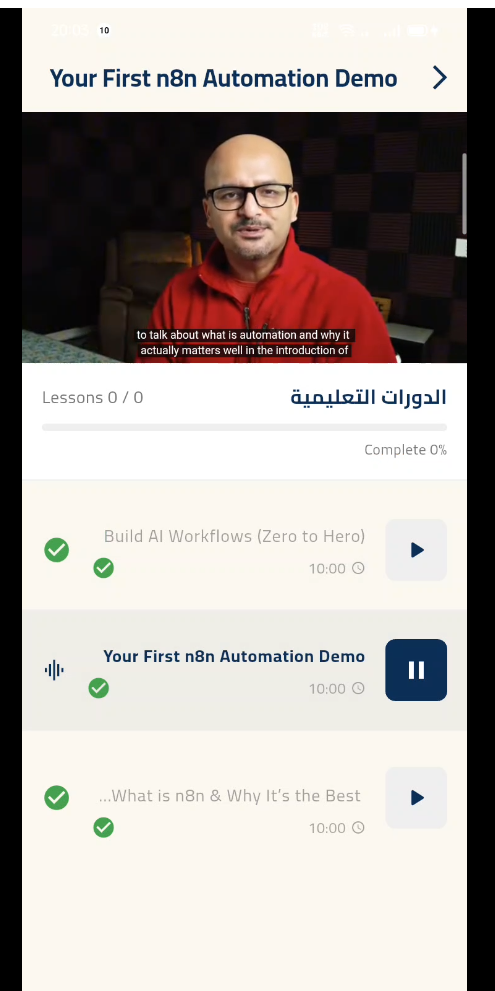
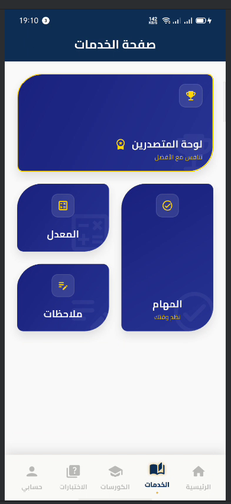
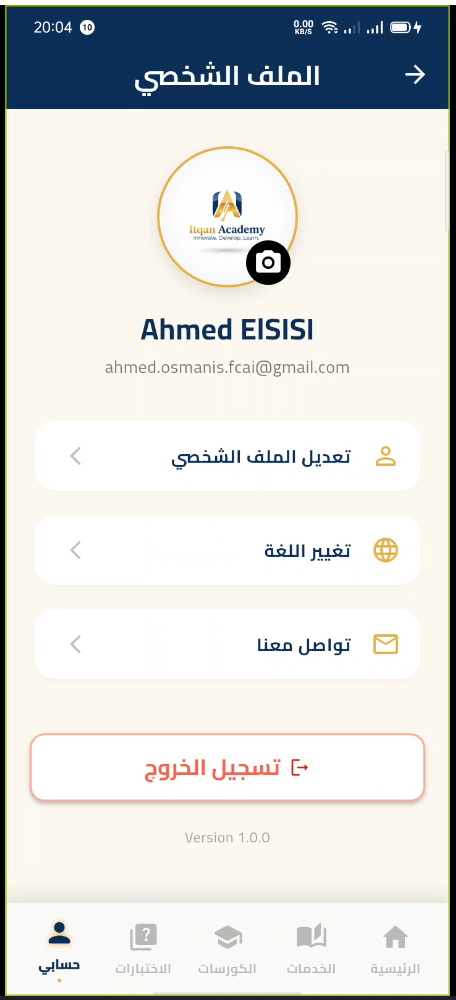
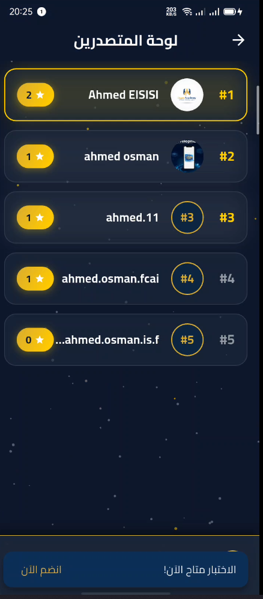

# 🎓 ITQAN Academy App

### The Official Learning Platform for ITQAN Academy - Built with Elegance and Power.

## 📸 App Showcase (The Royal Design)

### 🆔 Identity

|           Splash Screen           |              Login              |              Signup               |
| :-------------------------------: | :-----------------------------: | :-------------------------------: |
|  |  |  |

### 🚀 Core Experience

|        Home Dashboard         |             My Courses              |              Video Player              |
| :---------------------------: | :---------------------------------: | :------------------------------------: |
|  |  |  |

### ⚙️ Management

|         Services & Bento Grid         |            User Profile             |                 Leaderboard                 |
| :-----------------------------------: | :---------------------------------: | :-----------------------------------------: |
|  |  |  |

_Add your screenshots to the `screenshots` folder with the filenames above to populate this showcase._

## 🌟 Project Highlights

- **Royal Cream & Navy Theme**: A custom-designed UI that blends professional academic branding with modern aesthetics.
- **Innovative Bento Grid**: A non-traditional layout for student services (GPA, Tasks, Notes) to enhance user experience.
- **Static Arabic Identity**: A layout that maintains its premium "Vibe" and custom corner radiuses (40px/10px) across both Arabic and English.
- **Leaderboard System**: Fully integrated ranking logic with metallic gold accents.

## 🛠 Tech Stack & Tools

- **Frontend**: Flutter & Dart (100% Focused Architecture).
- **Backend**: Supabase (Real-time Database & Authentication).
- **UI/UX**: Custom Glassmorphism effects and Royal Navy card styling.
- **Git Strategy**: Professional commit history and clean linguist-vendored statistics.

## 🚀 Key Achievements in this Version

- **Resolved Critical Errors**: Fixed RenderFlex overflows and BorderRadius type cast exceptions.
- **Clean Code**: Refactored legacy banner code for a better developer experience.
- **Visual Polishing**: Implemented golden metallic icons and animated GPA text.

---

_Developed with ❤️ by the Itqan Academy Team_
